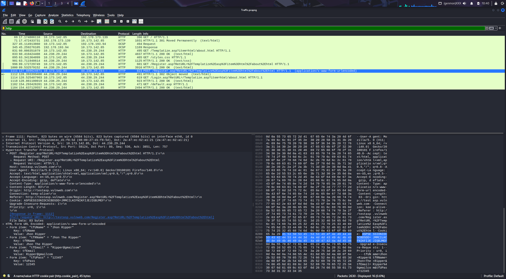
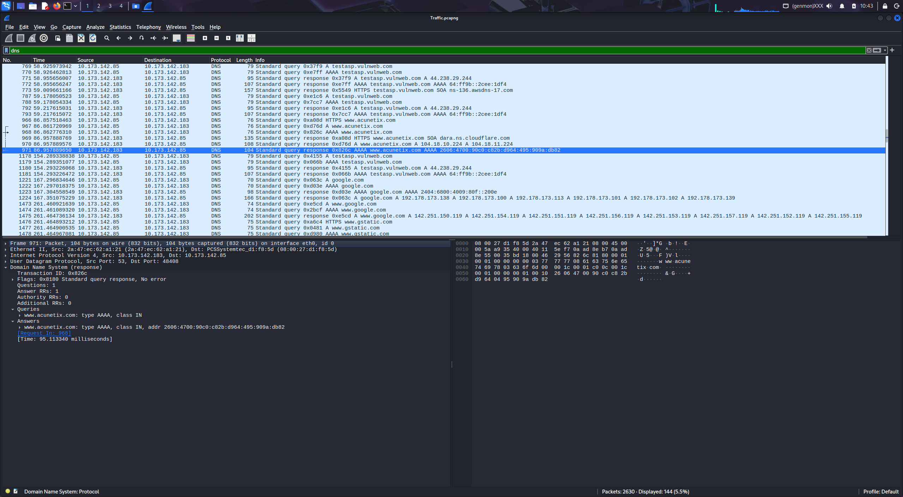
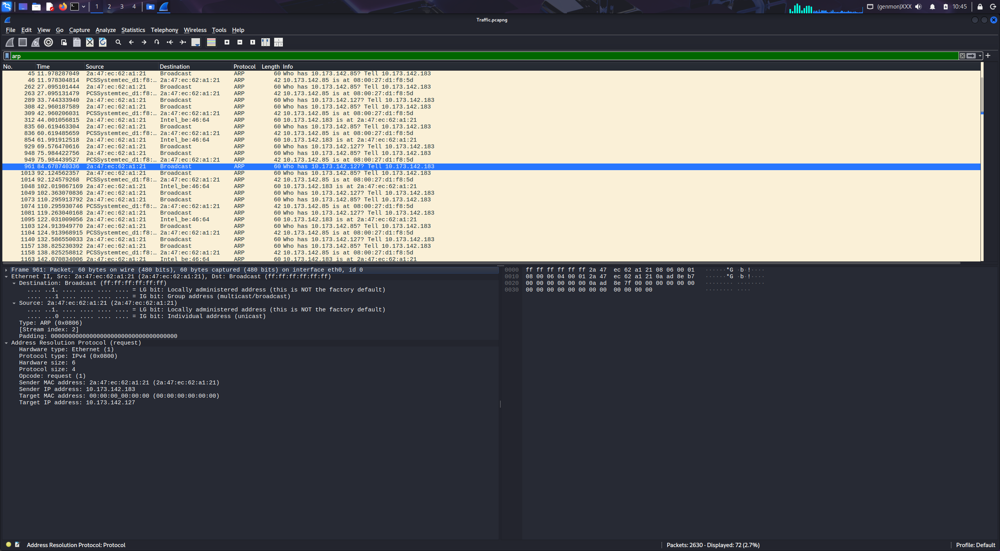
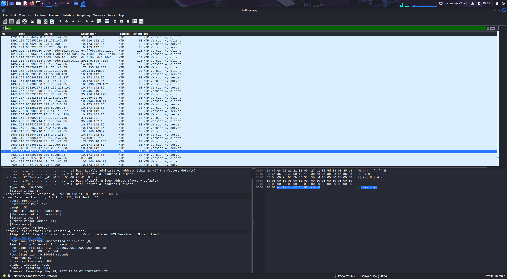
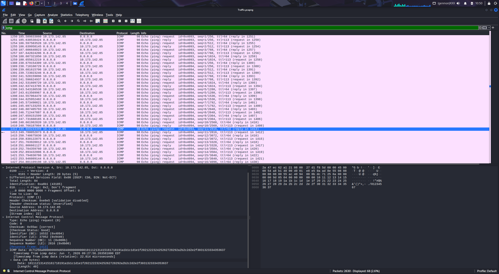
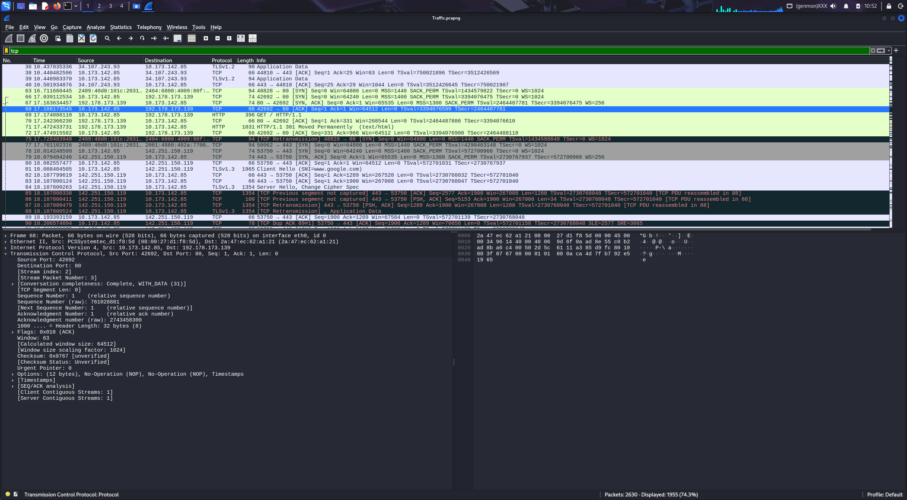

# 📡 Network Traffic Analysis with Wireshark - Cyber security Task 5

## 🎯 Objective  
Analyse the packet capture `Traffic.pcapng` using Wireshark to identify network protocols, examine communication patterns, and uncover security vulnerabilities – specifically plaintext transmission of sensitive data over HTTP.

## 🛠️ Tools & Environment  
- **Wireshark** – Network protocol analyzer    
- **Analysis Host** – Kali Linux  
- **Firefox Browser** – Traffic Generation
- **Chatgpt** - Analysis of the `Traffic.pcapng` and Report creation 

## 📊 Executive Summary

The capture reveals **critical security vulnerabilities** due to transmission of sensitive user data over unencrypted HTTP. An attacker with access to the same network segment could passively intercept:

| Exposed Data | Example Value | Sensitivity |
|--------------|---------------|--------------|
| Username | `Jhon Ripper` | High |
| Full Name | `Jhon The Ripper` | PII |
| Email Address | `Ripper@gmailcom` | PII |
| Password | `12345` | Confidential (Critical) |
| Session Cookie | `ASPSESSIONIDCSCBDSDD=JMMCILKCFNIKFIJIEJIGBJMEF` | Authentication Secret |

All Google communications used HTTPS (encrypted), but the registration process on `testasp.vulnweb.com` was transmitted in plaintext – making credential theft trivial.

## 📈 Packet Capture Overview

| Metric | Value |
|--------|-------|
| File Type | PCAPNG |
| Total Packets | 2,630 |
| Main Internal Host | `10.173.142.85` |
| External Services | Google (`142.251.150.119`), `testasp.vulnweb.com` |
| Sensitive Data Found | ✅ Yes (Critical severity) |

### Protocol Distribution

| Protocol | Packet Count | Percentage | Image |
|----------|--------------|------------|-------|
| TCP | 1,955 | 74.3% | `tcp.png` |
| NTP | 152 | 5.8% | `ntp.png` |
| DNS | 144 | 5.5% | `dns.png` |
| ARP | 72 | 2.7% | `arp.png` |
| ICMP | 68 | 2.6% | `icmp.png` |
| HTTP | 16 | 0.6% | `http.png` |

> **Note:** HTTPS traffic is classified under TCP (encrypted payload). The HTTP category includes only plaintext web requests.

## 🔍 Protocol Analysis (Total Traffic)

### 1. HTTP (Hypertext Transfer Protocol) – `http.png` ⚠️ **CRITICAL FINDING**

Application layer protocol for transferring web pages and form data between browsers and web servers.

- **Packets Analyzed:** 16 HTTP requests/responses (0.6% of total)
- **Target Server:** `testasp.vulnweb.com` (vulnerable web application)
- **Request Types:** POST and GET requests
- **Critical Finding:** Unencrypted sensitive data transmission – username, real name, email, and password (`12345`) visible in plaintext

  
*Figure 1: Unencrypted HTTP POST showing full credentials in clear text.*

---

### 2. DNS (Domain Name System) – `dns.png`

System that translates human-readable domain names into IP addresses that computers use.

- **Packets Analyzed:** 144 DNS queries/responses (5.5% of total)
- **Primary Queries:** `www.acunetix.com`, Google services, `testasp.vulnweb.com`
- **Query Type Observed:** AAAA (IPv6) for `acunetix.com`
- **Response Time:** 95.11 ms for the highlighted query

  
*Figure 2: DNS response for acunetix.com showing IPv6 resolution.*

---

### 3. ARP (Address Resolution Protocol) – `arp.png`

Protocol that maps IP addresses to physical MAC addresses on local network segments.

- **Packets Analyzed:** 72 ARP requests/responses (2.7% of total)
- **Function:** MAC address resolution and network discovery
- **Observed Activity:** Broadcast from `10.173.142.183` asking “Who has `10.173.142.127`?”
- **Environment:** Local network segment (likely VMware virtual network)

  
*Figure 3: ARP request – local network address resolution.*

---

### 4. NTP (Network Time Protocol) – `ntp.png`

Protocol that synchronizes computer clocks across networks to maintain accurate time.

- **Packets Analyzed:** 152 NTP requests/responses (5.8% of total)
- **Purpose:** System time synchronization
- **Port:** UDP 123
- **Time Server:** `139.59.55.93` (external)
- **Version:** NTPv4 client request from `10.173.142.85`

  
*Figure 4: NTPv4 time synchronisation request.*

---

### 5. ICMP (Internet Control Message Protocol) – `icmp.png`

Network diagnostic protocol used for error reporting and network troubleshooting (like ping commands).

- **Packets Analyzed:** 68 ICMP messages (2.6% of total)
- **Types Observed:** Echo Request / Echo Reply (ping)
- **Purpose:** Network diagnostics and connectivity verification
- **Example:** Echo reply from `8.8.8.8` (Google DNS) to internal host `10.173.142.85`

  
*Figure 5: Ping reply from Google DNS confirming external connectivity.*

---

### 6. TCP (Transmission Control Protocol) – `tcp.png`

Reliable transport protocol that ensures data is delivered completely and in the correct order between devices.

- **Packets Analyzed:** 1,955 packets (74.3% of total – majority of traffic)
- **Purpose:** Reliable, connection-oriented transport protocol
- **Key Features:**
  - Three-way handshake connection establishment
  - Sequence numbers for ordered delivery
  - Acknowledgment-based reliability
  - Window size (`65535`) for flow control
- **Carries:** HTTP (including the vulnerable registration POST), HTTPS, and other application protocols
- **Security Note:** Underlying transport for unencrypted HTTP traffic – enabled interception of plaintext credentials

  
*Figure 6: TCP acknowledgment showing transport layer reliability mechanisms.*

---

## 🚨 Security Findings Summary

| Finding | Severity | Evidence |
|---------|----------|----------|
| Plaintext password transmission | 🔴 High | `tfUPass=12345` in HTTP POST |
| Exposed registration form data | 🔴 High | Full name, email, username visible |
| PII disclosure | 🔴 High | Email + real name transmitted unencrypted |
| Weak password (`12345`) | ⚫ Critical | Common, brute-forceable password |
| Authentication over HTTP | 🔴 High | Login and registration pages lack HTTPS |
| Session cookie exposure | 🟠 Medium | `ASPSESSIONID...` sent over HTTP without Secure flag |
| Application fingerprinting | 🟡 Low | ASP.NET indicators (`Register.asp`, `ASPSESSIONID`) |
| MITM attack feasibility | 🔴 High | Entire registration lifecycle observable |

### Detailed Risk Analysis

- **Credential Theft (Critical):** The password `12345` is among the most commonly breached credentials. Combined with the email, an attacker could perform credential stuffing.
- **Session Hijacking (High):** The cookie `ASPSESSIONIDCSCBDSDD=...` observed over HTTP. If the app does not regenerate session IDs after login, an attacker can reuse this cookie to impersonate the user.
- **Man-in-the-Middle (High):** Since registration/login use HTTP, an attacker on the same Wi‑Fi, LAN, or via ARP spoofing can capture credentials, modify requests, inject malicious responses, or hijack sessions.

## 🔧 Methodology

| Step | Action |
|------|--------|
| 1 | Load `Traffic.pcapng` into Wireshark |
| 2 | Apply display filters: `http`, `dns`, `arp`, `icmp`, `ntp`, `tcp` |
| 3 | Calculate packet counts and percentages for each protocol |
| 4 | Inspect packet details; follow TCP streams; extract form data |
| 5 | Identify plaintext sensitive data using “Find Packet” feature |
| 6 | Classify findings by severity |
| 7 | Document recommendations and create screenshot references |

## 📝 Recommendations

### Immediate Actions
1. **Enforce HTTPS across all pages** – especially `/Register.asp` and `/Login.asp`
2. **Disable plaintext HTTP access** – redirect all HTTP to HTTPS (301 redirect)
3. **Enable HSTS** (HTTP Strict Transport Security)
4. **Set secure session cookie flags:**
   - `Secure` – only sent over HTTPS
   - `HttpOnly` – not accessible via JavaScript
   - `SameSite=Strict` – mitigates CSRF

### Credential Security
- Never transmit passwords over HTTP – use TLS 1.2+ exclusively
- Enforce strong password policies (minimum 12 characters, complexity)
- Implement Multi-Factor Authentication (MFA)
- Hash passwords using modern algorithms: **Argon2**, **bcrypt**, **scrypt**

### Monitoring & Testing
- Deploy IDS/IPS signatures to detect plaintext credential leakage
- Regularly scan for rogue HTTP services on internal networks
- Perform periodic packet capture reviews for sensitive data exposure
- Regenerate session IDs after successful authentication

## 📈 Learning Outcomes

- ✅ Hands-on analysis of live network traffic using Wireshark  
- ✅ Identification of six common protocols (ARP, DNS, HTTP, ICMP, NTP, TCP) with total packet distribution  
- ✅ Detection of plaintext credentials and PII in HTTP POST requests  
- ✅ Understanding of TCP reliability mechanisms (sequence numbers, ACK, windowing)  
- ✅ Assessment of security risks from unencrypted application‑layer traffic  
- ✅ Production of a professional security report with actionable recommendations  

## 📁 Repository Contents

| File | Description |
|------|-------------|
| `Traffic.pcapng` | Original packet capture (2,630 packets) |
| `Wireshark Traffic Analysis Report.pdf` | Detailed security analysis PDF |
| `arp.png` | ARP broadcast (72 packets) |
| `dns.png` | DNS AAAA response for acunetix.com (144 packets) |
| `http.png` | HTTP POST with plaintext credentials (16 packets – Critical) |
| `icmp.png` | ICMP Echo reply from 8.8.8.8 (68 packets) |
| `ntp.png` | NTPv4 client time request (152 packets) |
| `tcp.png` | TCP ACK packet on port 80 (1,955 packets) |
| `README.md` | This comprehensive analysis report |

## ✅ Conclusion

This traffic analysis project successfully identified critical security weaknesses in a web application’s implementation. Despite the majority of packets being TCP (74.3%) and the presence of encrypted Google traffic, the registration process on `testasp.vulnweb.com` transmitted usernames, real names, email addresses, and passwords in **clear text over HTTP**. The password `12345` represents a critical failure of credential policy.

The findings demonstrate that even simple packet captures can reveal highly sensitive information when encryption is not enforced. Organisations must mandate HTTPS across all pages, implement secure session handling, and regularly audit network traffic to prevent credential theft, session hijacking, and man‑in‑the‑middle attacks.

**Risk Statement:** The absence of TLS encryption makes the application susceptible to passive credential interception and active MITM attacks. Immediate remediation is required.

---

*This report was generated as part of a network security exercise using Wireshark on Kali Linux. All captured data is from a controlled, vulnerable test environment (`testasp.vulnweb.com`).*
