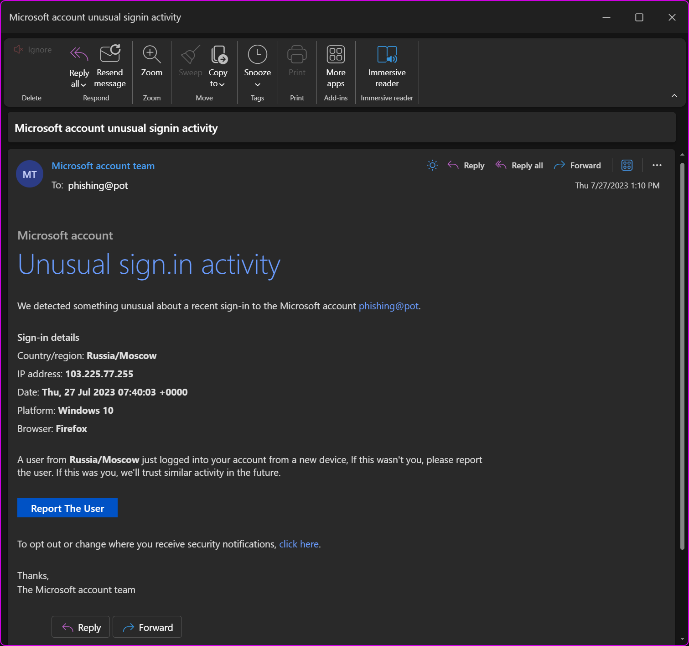
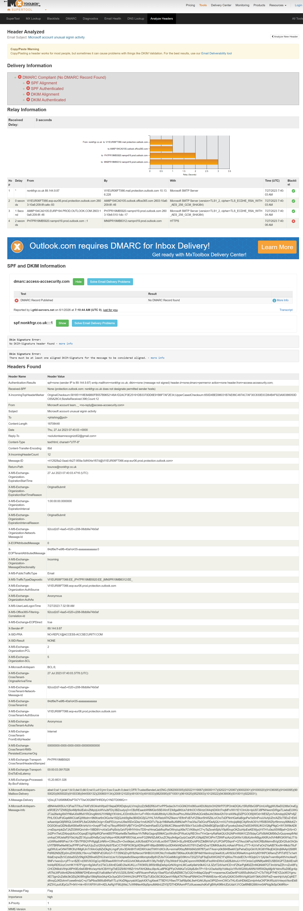

# 🎣 Phishing Email Analysis Report – Cyber Security Internship Task 2

  
  
  

----

## 🎯 Objective
Analyze a suspected phishing email to identify spoofing indicators, authentication failures, and social engineering tactics. Learn to inspect email headers using online tools and recognize red flags that distinguish legitimate security alerts from malicious messages.

## 🛠️ Tools & Environment
- **Microsoft Outlook** – Email client for viewing the suspicious message  
- **MXToolbox Header Analyzer** – Online tool for parsing and analyzing email headers  
  🔗 [https://mxtoolbox.com/EmailHeaders.aspx](https://mxtoolbox.com/EmailHeaders.aspx)  
- **Sample Source** – Public phishing email repository  

## 📥 Source of Sample Phishing Email
The email used in this analysis was downloaded from the following open‑source repository:

🔗 [rf-peixoto/phishing_pot – GitHub Repository](https://github.com/rf-peixoto/phishing_pot/tree/main)

> This repository contains real‑world phishing examples for educational and research purposes.

## 🔎 Steps Taken

1. **Opened the sample email** in Microsoft Outlook to view its appearance and content.  
2. **Extracted the full email headers** from the message.  
3. **Pasted headers into MXToolbox Header Analyzer** for automated parsing.  
4. **Reviewed the analyzer output** alongside the raw headers to identify discrepancies.  
5. **Documented all phishing indicators** including spoofed domains, authentication failures, and manipulative language.

---

## 📊 Header Analysis (MXToolbox Output)

The following headers were extracted and analyzed. Key findings are highlighted in **bold**.

| Header Name | Header Value |
|-------------|---------------|
| **Authentication-Results** | spf=none (sender IP is 89.144.9.87) smtp.mailfrom=nonkfrgr.co.uk; dkim=none (message not signed); dmarc=permerror action=none header.from=access-accuracy.com |
| **Received-SPF** | None (protection.outlook.com: nonkfrgr.co.uk does not designate permitted sender hosts) |
| **From** | Microsoft account team, `<no-reply@access-accuracy.com>` |
| **Subject** | Microsoft account unusual signin activity |
| **To** | `<phishing@pot>` |
| **Reply-To** | `<solutionteamrecognizd02@gmail.com>` |
| **Return-Path** | bounce@nonkfrgr.co.uk |
| **X-Sender-IP** | 89.144.9.87 |
| **X-MS-Exchange-Organization-SCL** | 5 (Spam Confidence Level – likely spam) |
| **X-Microsoft-Antispam** | BCL:6 (Bulk Complaint Level – high) |
| **Date** | Thu, 27 Jul 2023 07:40:03 +0000 |
| **Content-Type** | text/html; charset="UTF-8" |
| **Message-ID** | `<412928a2-0aad-4b27-959a-5df404e1f07d@V11EUR06FT066.eop-eur06.prod.protection.outlook.com>` |

### Additional Delivery Headers

| Header | Value |
|--------|-------|
| X-MS-Exchange-Organization-AuthAs | Anonymous |
| X-MS-Exchange-Organization-AuthSource | V11EUR06FT066.eop-eur06.prod.protection.outlook.com |
| X-MS-Office365-Filtering-Correlation-Id | 92ccd2d7-4aa5-4320-c208-08db8e74b0af |
| X-MS-Exchange-CrossTenant-AuthAs | Anonymous |
| X-MS-Exchange-CrossTenant-FromEntityHeader | Internet |

> ℹ️ **Note**: The MXToolbox analyzer also reported **“DMARC Compliant (No DMARC Record Found)”** – meaning the sender domain `access-accuracy.com` has no DMARC policy, which is common in phishing campaigns.

---

## 📸 Screenshots

### Email as seen in Microsoft Outlook

### MXToolbox Header Analyzer output (partial)

---

## 🚩 Phishing Indicators Identified

| Indicator Type | Description |
|----------------|-------------|
| **Spoofed Sender** | “Microsoft account team” but actual domain is `access-accuracy.com` (not owned by Microsoft) |
| **Fake Reply Address** | `solutionteamrecognizd02@gmail.com` – a free Gmail account, not Microsoft |
| **Return Path Mismatch** | `bounce@nonkfrgr.co.uk` – completely unrelated to Microsoft |
| **SPF Failure** | `spf=none` – the sending IP `89.144.9.87` is not authorized by the domain owner |
| **DKIM Missing** | `dkim=none` – message not digitally signed |
| **DMARC Permerror** | No valid DMARC policy – domain not protected against spoofing |
| **High Spam Scores** | SCL = 5, BCL = 6 – Microsoft’s own filters marked it as suspicious |
| **Authentication** | `X-MS-Exchange-Organization-AuthAs: Anonymous` – no authenticated sending |
| **Urgent/Threatening Language** | “Unusual sign‑in activity”, “If this wasn't you, please report the user” |
| **Fake Sign‑in Details** | Claims login from `Russia/Moscow` with IP `103.225.77.255` to induce fear |
| **Suspicious Link** | “Report The User” button likely points to the Gmail address or a malicious site (not a real Microsoft page) |
| **Grammar Errors** | “sign.in activity” (odd punctuation), inconsistent spacing |

---

## 📋 Summary of Red Flags

| Field | Finding / Red Flag |
|-------|--------------------|
| **From** | `access-accuracy.com` – not Microsoft |
| **Reply-To** | Gmail address – not Microsoft |
| **Return-Path** | `nonkfrgr.co.uk` – random, unrelated domain |
| **SPF / DKIM / DMARC** | All failed or missing |
| **Sender IP** | `89.144.9.87` – not a Microsoft IP range |
| **Subject** | Urgent security alert (common phishing trigger) |
| **SCL / BCL** | 5 and 6 – classified as spam/bulk by Microsoft |
| **AuthAs** | Anonymous – no authenticated sending |
| **Content** | Fake Russian login + “Report The User” button leading to attacker control |
| **Branding** | No official Microsoft footers, privacy links, or digital signatures |

---

## ✅ Conclusion

This email exhibits **multiple classic phishing indicators**:

- Complete failure of email authentication (SPF, DKIM, DMARC)  
- Spoofed Microsoft branding with a fake sender domain  
- Reply address pointing to a personal Gmail account  
- Urgent, fear‑inducing language about unauthorised login  
- Suspicious links that do not go to legitimate Microsoft properties  
- High spam scores from Microsoft’s own filters  

> **Recommendation:**  
> Do **not** click any links, reply, or download attachments from this email.  
> Mark it as **phishing** in your email client. If you received this at work, report it to your IT/Security team immediately.  
> Use this analysis as a reference for training others to recognise similar threats.

---

## 📁 Files in this Repository

- `sample-1001.eml` – The original phishing email (raw format)  
- `sample_mail.png` – Screenshot of the email as displayed in Outlook  
- `mstoolbox_analysis.png` – MXToolbox Header Analyzer output

---

## 📚 References

- [MXToolbox Email Header Analyzer](https://mxtoolbox.com/EmailHeaders.aspx)  
- [Phishing Pot – Sample Emails Repository](https://github.com/rf-peixoto/phishing_pot)  
- [Microsoft: How to report phishing](https://support.microsoft.com/en-us/windows/protect-yourself-from-phishing-0c7ea947-ba98-3bd9-7184-430e3f4f5c5a)  
- [DMARC.org – Email authentication](https://dmarc.org/)  

> ⚠️ **Note**: This analysis was performed on a sample obtained from an authorised educational repository. Always obtain permission before analysing real emails that do not belong to you.
