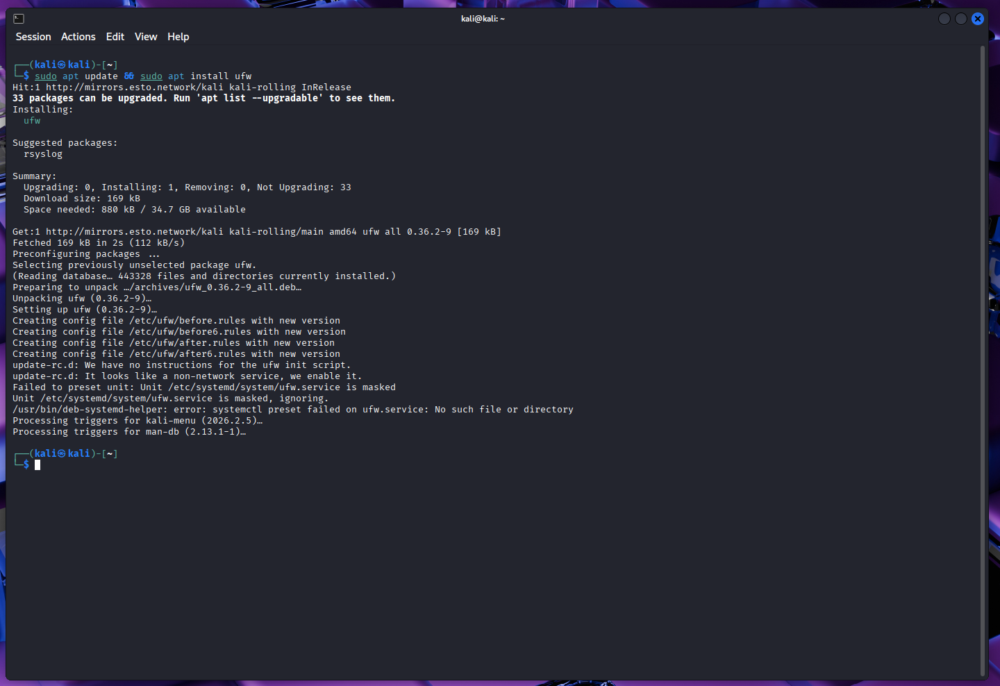
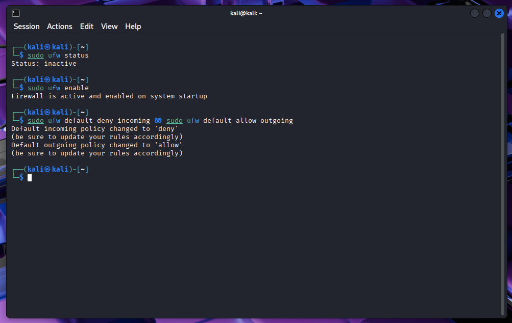
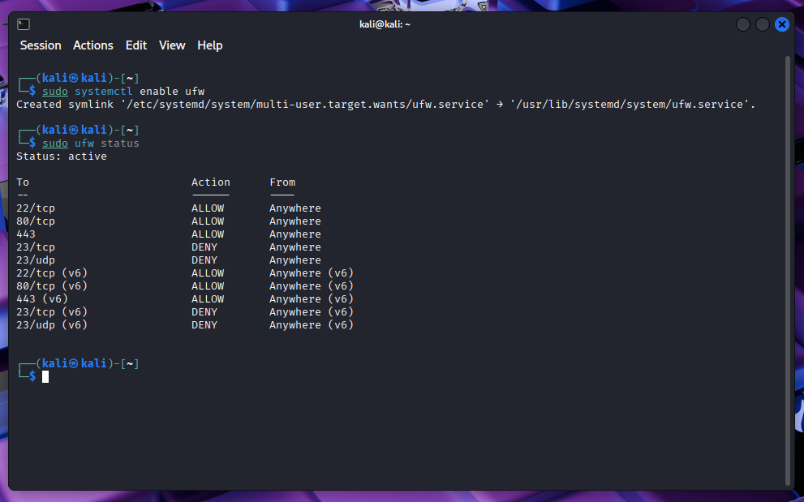
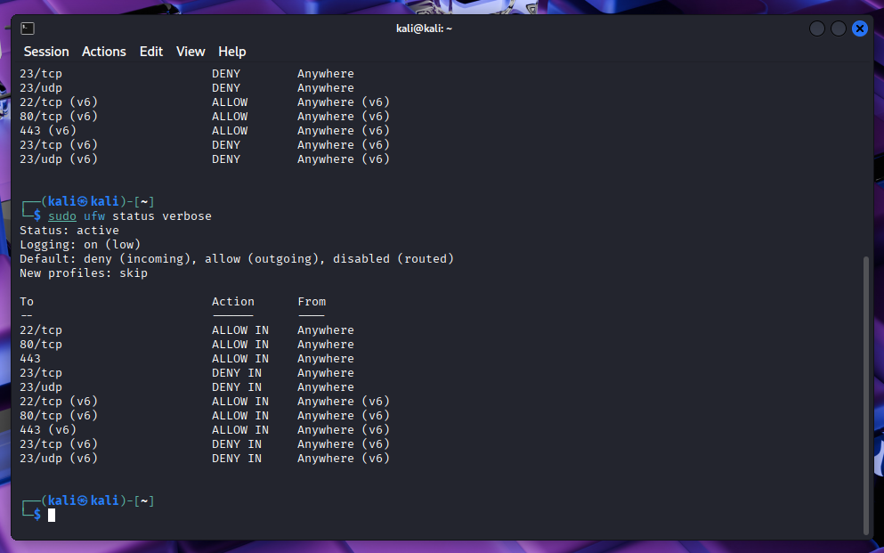
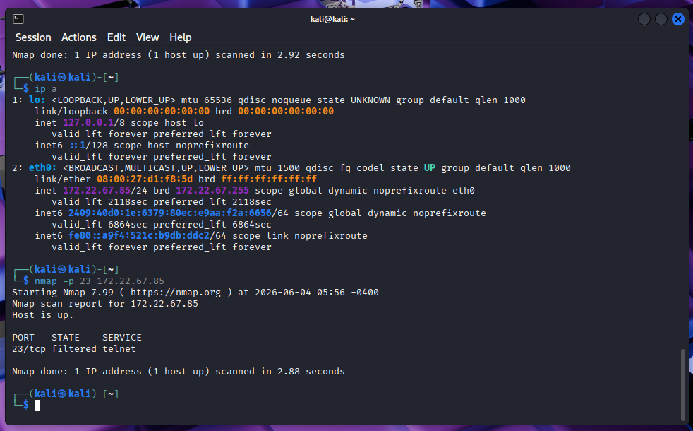

# 🧱 UFW Firewall Configuration  – Cyber Security Internship Task 4
<p align="center">


</p>
----
## 🎯 Objective  
Configure and test basic firewall rules using **UFW (Uncomplicated Firewall)** on Kali Linux to block insecure Telnet traffic (port 23), allow essential services (SSH, HTTP, HTTPS), and validate the filtering behaviour. Remove the test rule to restore the original state.

## 🛠️ Tools & Environment  
- **UFW** – Uncomplicated Firewall (frontend to iptables)  
- **Target System** – Kali Linux (IP `172.22.67.85`) running in VMware  
- **Testing Tools** – `nmap`, `telnet`, `ip a`, `systemctl`  
- **Logging** – UFW logging enabled for monitoring

## 📥 Initial Setup

| Step | Command | Purpose |
|------|---------|---------|
| Install UFW | `sudo apt update && sudo apt install ufw` | Install firewall package |
| Enable UFW | `sudo ufw enable` | Activate firewall immediately |
| Boot persistence | `sudo systemctl enable ufw` | Start on system boot |
| Default policies | `sudo ufw default deny incoming`<br>`sudo ufw default allow outgoing` | Block all inbound by default, allow outbound |
| Enable logging | `sudo ufw logging on` | Log dropped packets for analysis |

  
*Figure 1: Installing UFW package on Kali Linux.*

  
*Figure 2: Enabling UFW and setting default deny/allow policies.*

  
*Figure 3: Creating systemd symlink for automatic startup.*

---

## 🔧 Firewall Rules Configuration

### Rules Added

| Service | Port | Protocol | Action | Command |
|---------|------|----------|--------|---------|
| SSH | 22 | TCP | ALLOW | `sudo ufw allow ssh` |
| HTTP | 80 | TCP | ALLOW | `sudo ufw allow 80/tcp` |
| HTTPS | 443 | TCP | ALLOW | `sudo ufw allow 443` |
| Telnet | 23 | TCP | DENY | `sudo ufw deny 23/tcp` |
| Telnet | 23 | UDP | DENY | `sudo ufw deny 23/udp` |

After applying the rules, verify with:

```bash
sudo ufw status verbose
```


*Figure 4: UFW status showing active rules – SSH/HTTP/HTTPS allowed, Telnet blocked (both IPv4 and IPv6).*

## 🧪 Testing the Firewall Rule (Block Port 23)

### Local Test (from the same machine)

```bash
telnet localhost 23
```

Result: Connection refused – firewall blocks the attempt.

### Remote Test (using nmap from the same machine – simulates external scan)

```bash
ip a                           # Get local IP (172.22.67.85)
nmap -p 23 172.22.67.85
```

Result:

```text
PORT    STATE    SERVICE
23/tcp  filtered telnet
```

filtered means the firewall dropped the packet without a response – the rule is working.



Figure 5: Nmap scan showing port 23 as filtered – Telnet traffic successfully blocked.

## 🧹 Restore Original State (Remove Test Block Rule)

As required by the task, remove only the test block rule (port 23) while keeping the permanent allow rules.

```bash
sudo ufw delete deny 23/tcp
sudo ufw delete deny 23/udp
```

Verify removal:

```bash
sudo ufw status
```

Final active rules (after cleanup):

✅ SSH (22/tcp) – ALLOW

✅ HTTP (80/tcp) – ALLOW

✅ HTTPS (443) – ALLOW

❌ Telnet (23) – rule removed (default deny now applies)

💡 The default deny incoming policy will still block any unsolicited connection to port 23, but the explicit DENY rule is gone – this restores the original state before the test.

## 📊 Summary of Firewall Traffic Filtering

A firewall filters network traffic by inspecting packet headers – source/destination IP, protocol (TCP/UDP/ICMP), and port number.

UFW translates simple rules into iptables chains:

Incoming traffic is evaluated against rules in order:

- If a packet matches an ALLOW rule → accepted.
- If it matches a DENY rule → silently dropped (or rejected).
- If no match → default policy applies (here: deny).

Outgoing traffic is permitted by default (maintains system updates and user browsing).

Stateful filtering tracks connection states (NEW, ESTABLISHED, RELATED) – return traffic for allowed outbound connections is automatically accepted.

In this lab, blocking Telnet (port 23) eliminates an insecure, plain-text protocol, reducing the attack surface.

## 📈 Learning Outcomes

- Hands-on configuration of UFW – enabling, setting default policies, adding/removing rules.
- Understanding the difference between DENY and default deny behaviour.
- Testing firewall rules with nmap and telnet – interpreting filtered vs connection refused.
- Importance of rule order and persistence (enabling on boot).
- Creating a clean, documented firewall configuration suitable for production use.

## 📁 Files in this Repository

- UFW_Installation.png – UFW package installation
- UFW_Enable.png – Enabling UFW and setting default policies
- UFW_Enable_Startup.png – Systemd enable for boot startup
- UFW_Result.png – Final ufw status verbose output
- UFW_Testing_via_Nmap.png – Nmap scan showing port 23 filtered

## ✅ Conclusion

This exercise successfully demonstrated basic firewall management using UFW on Kali Linux.

- Block rule for port 23 was added and tested (nmap showed filtered).
- Essential services (SSH, HTTP, HTTPS) remained accessible.
- The test rule was removed, restoring the original state.
- The firewall’s default deny incoming policy ensures that any unconfigured port is automatically protected.

The skills acquired – adding/removing rules, testing with network tools, understanding stateful filtering – are fundamental to system hardening and network security.

⚠️ Note: Always allow SSH (port 22) before enabling UFW on a remote machine to avoid lockout. In this local VM environment, console access prevented any risk.
