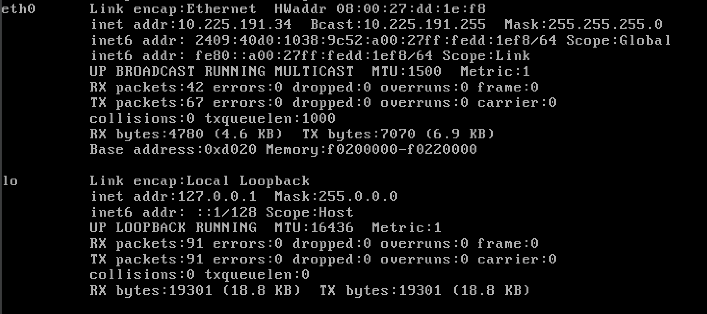
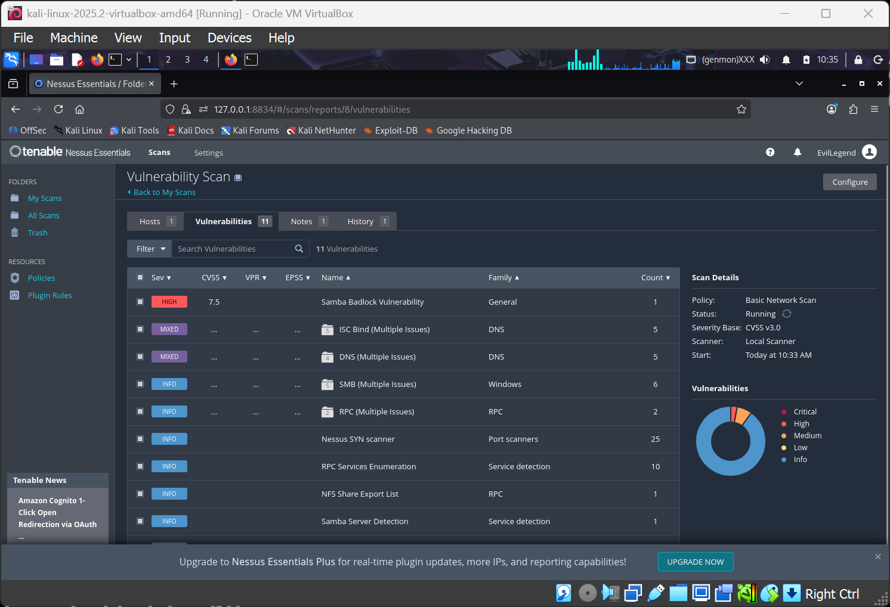
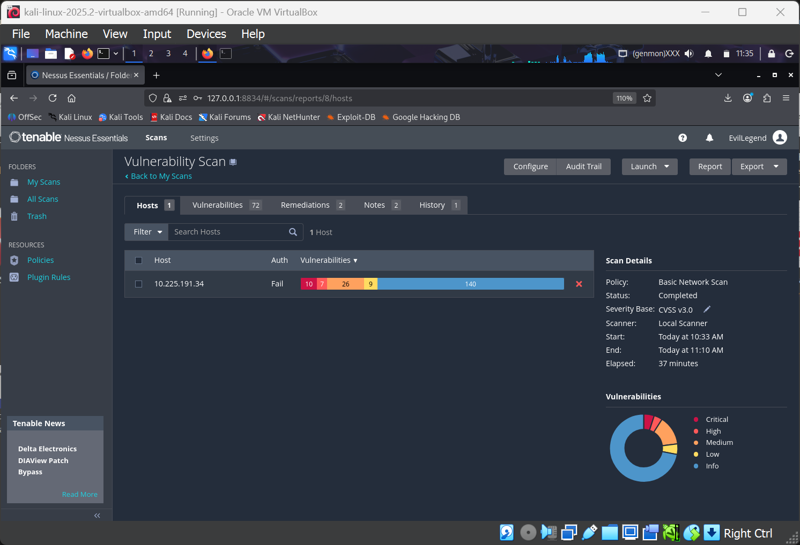
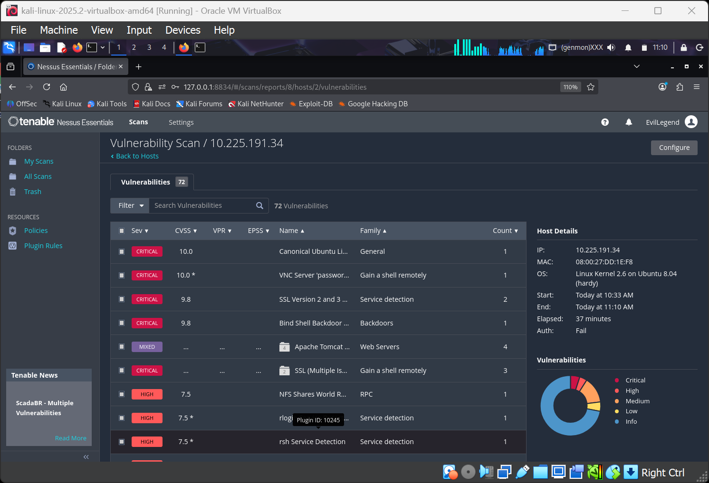

# 🛡️ Vulnerability Assessment Report – Nessus Essentials Scan (Task 3)

## 🎯 Objective  
Perform a basic vulnerability scan on a local machine (Kali Linux) using **Tenable Nessus Essentials**, identify common security weaknesses, and document the findings with remediation steps. Gain hands‑on experience with industry‑standard scanning tools and risk assessment.

## 🛠️ Tools & Environment  
- **Tenable Nessus Essentials** – Free vulnerability scanner (v10.8.4)  
- **Target System** – Ubuntu 8.04 (IP `10.225.191.34`) running in VirtualBox  
- **Host OS** – Windows / Linux (scanner installed on same host as target)  
- **Scan Type** – Basic Network Scan (full system assessment)

## 📥 Scan Configuration  

| Setting | Value |
|---------|-------|
| Scan Name | Vulnerability Scan |
| Target IP | `10.225.191.34` |
| Policy | Basic Network Scan |
| Scanner | Local Scanner |
| Start Time | Today at 10:33 AM |
| End Time | Today at 11:10 AM |
| Duration | 37 minutes |

  
*Figure 1: Target IP address displayed via `ifconfig` on Kali Linux.*

  
*Figure 2: Basic Network Scan settings – target IP and credentials.*

  
*Figure 3: Nessus scan running – live status showing discovered services.*

## 📊 Scan Results Overview  

- **Total Vulnerabilities**: 72  
- **Critical**: 7  
- **High**: 9  
- **Medium**: 26  
- **Low**: 10  
- **Info**: 20  

  
*Figure 4: Nessus dashboard – 72 vulnerabilities found, scan duration 37 minutes.*

  
*Figure 5: Host summary – IP 10.225.191.34, OS: Linux Kernel 2.6 on Ubuntu 8.04 (hardy).*

---

## 🔴 Critical & High Severity Findings

| Severity | CVSS v3.0 | Plugin Name | Description |
|----------|-----------|-------------|-------------|
| **CRITICAL** | 10.0 | Canonical Ubuntu Linux Security Advisory | Multiple unpatched kernel vulnerabilities |
| **CRITICAL** | 10.0 | VNC Server 'password' Backdoor | VNC authentication bypass / default password |
| **CRITICAL** | 9.8 | SSL Version 2 and 3 Protocol Detection | SSLv2/SSLv3 enabled – POODLE, DROWN attacks possible |
| **CRITICAL** | 9.8 | Bind Shell Backdoor Detection | Port 1524 – unauthenticated root shell (`wild_shell`) |
| **CRITICAL** | 9.8 | vsFTPD 2.3.4 Backdoor (CVE‑2011‑2523) | Remote root compromise |
| **CRITICAL** | 9.8 | UnrealIRCd 3.2.8.1 Backdoor (CVE‑2010‑2075) | Remote code execution |
| **HIGH** | 7.5 | NFS Shares World Readable | Entire root filesystem exported without root squashing |
| **HIGH** | 7.5 | rlogin Service Detection | Cleartext remote login on port 513 |
| **HIGH** | 7.5 | rsh Service Detection | Cleartext remote shell on port 514 |
| **HIGH** | 7.5 | Samba Badlock Vulnerability (CVE‑2016‑2118) | Man-in-the-middle risk |
| **HIGH** | 7.5 | ISC BIND Multiple Vulnerabilities | DNS recursion + outdated version 9.4.2 |

> *Full list of 72 vulnerabilities is available in the raw Nessus output (`nessus_scan_raw_10.225.191.34.txt`).*

---

## 🔧 Remediation Recommendations

### Immediate Actions (Critical/High)

1. **Remove backdoors**  
   - Disable vsFTPd, UnrealIRCd, and the bind shell on port 1524.  
   - Update or remove vulnerable services.

2. **Fix SSL/TLS configuration**  
   - Disable SSLv2 and SSLv3.  
   - Remove weak ciphers (RC4, DES, export-grade).  
   - Install a valid, non‑expired certificate.

3. **Secure network services**  
   - Disable rlogin/rsh; use SSH with key‑based authentication.  
   - Reconfigure NFS with `no_root_squash` removed and restrict exports.  
   - Set strong passwords for VNC, MySQL, PostgreSQL, Tomcat.

4. **Update all software**  
   - Upgrade OpenSSH, BIND, Samba, Apache, PHP, MySQL, Postgres.  
   - Apply Ubuntu 8.04 security patches or migrate to a supported OS (Ubuntu 8.04 is EOL since 2013).

### Long‑term Improvements

- Implement a regular vulnerability scanning schedule (monthly or quarterly).  
- Use a firewall to limit exposure of unnecessary services.  
- Enforce DMARC, SPF, DKIM for any mail server.  
- Conduct penetration testing to validate fixes.

---

## 📈 Learning Outcomes  

- Hands‑on use of **Nessus Essentials** – configuring scans, interpreting results.  
- Understanding **CVSS scores**, VPR, and EPSS for prioritisation.  
- Recognising **common vulnerabilities** in personal computers (outdated OS, weak SSL, backdoors, cleartext services).  
- Differentiating between **vulnerability scanning** and **penetration testing** (scanning identifies weaknesses, testing exploits them).  
- Creating a professional **vulnerability assessment report** with remediation steps.
- 
---

## 📁 Files in this Repository

- `Configuration for Scan.png` – Screenshot of Nessus scan configuration (target IP, credentials)  
- `Final_result.png` – Final vulnerability summary for host 10.225.191.34  
- `Observation_of_Tenable_Nessus.pdf` – PDF version of the vulnerability report  
- `README.md` – This complete analysis report  
- `Scanning_process.png` – Screenshot of Nessus scan in progress  
- `Target_ip.png` – `ifconfig` output showing target IP address  
- `Total_vulnerabilities.png` – Dashboard showing 72 total vulnerabilities  
- `nessus_scan_raw_10.225.191.34.txt` – Raw Nessus scan output (full plugin details)

---

## ✅ Conclusion  

This vulnerability assessment successfully identified **72 security issues** on the target Kali Linux machine, including **critical backdoors**, **weak SSL configurations**, and **cleartext services**. The exercise demonstrates the value of regular scanning and provides a clear remediation roadmap. The skills acquired are directly applicable to professional cybersecurity roles, especially in **risk assessment** and **security auditing**.

> ⚠️ **Note**: The target used (Kali Linux with Metasploitable2 services) is intentionally vulnerable. Do **not** expose such systems to untrusted networks. Always obtain proper authorisation before scanning any system you do not own.
