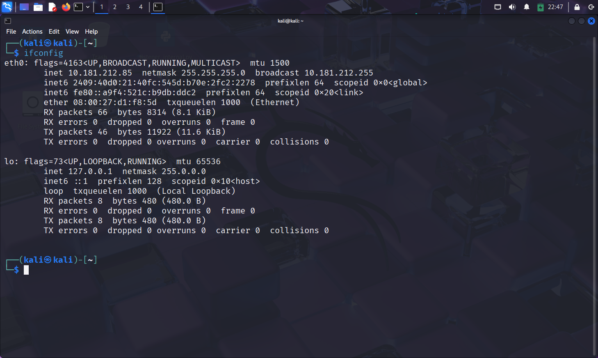
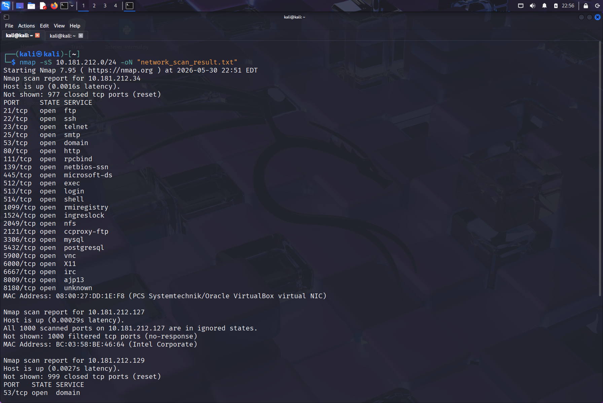
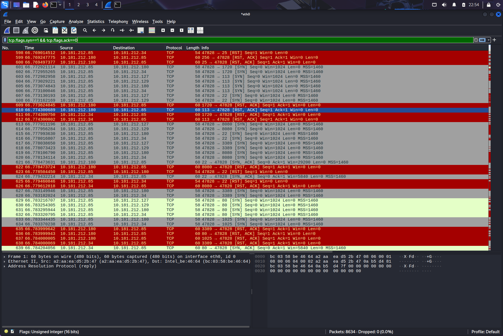

# 🔍 Local Network Port Scan – Cyber Security Internship Task 1
<p align="center">
  
  
  
</p>

---

## 🎯 Objective
Learn to discover open ports on devices in a local network using `nmap`, understand network exposure, and optionally analyze packet-level behavior with `wireshark`. Identify potential security risks from unnecessarily exposed services.

## 🛠️ Tools & Environment
- **Kali Linux** (Virtual Machine) – Attacker/Scanner  
- **Nmap 7.95** – Network scanner  
- **Wireshark 4.4.6** – For capturing and analyzing network traffic   

## 📡 Network Setup
- **Scanner IP**: `10.181.212.85`
- **Subnet scanned**: `10.181.212.0/24`  
- **Hosts discovered**: 5 active IPs (`.34`, `.127`, `.129`, `.180`, `.85`)  



## 🔧 Commands Used

### 1. Verify IP address
```bash
ifconfig
# Output shows eth0: inet 10.181.212.85 netmask 255.255.255.0
```

### 2. Run TCP SYN scan (-sS) on the whole subnet
```bash
sudo nmap -sS 10.181.212.0/24 -oN network_scan_result.txt
```
- `-sS`: Stealth SYN scan (half‑open)  
- `-oN`: Save output in normal format  

### 3. Capture traffic during scan (Wireshark)
- Start capture on `eth0`  
- Apply display filter: `tcp.flags.syn == 1 && tcp.flags.ack == 0` to see **only SYN packets**  
- Observe scan behaviour in real time  

## 🔐 Key Findings

### 🖥️ Host: `10.181.212.34` – **Highly vulnerable device**
This device has **23 open TCP ports** – many running dangerous or outdated services.

| Port | Service | Risk Level | Notes |
|------|---------|------------|-------|
| 21/tcp | FTP | 🔴 High | Anonymous login possible? |
| 22/tcp | SSH | 🟡 Medium | Weak credentials may exist |
| 23/tcp | Telnet | 🔴 Critical | Cleartext auth – easily sniffed |
| 25/tcp | SMTP | 🟡 Medium | Open relay risk |
| 53/tcp | DNS | 🟢 Low | Version enumeration |
| 80/tcp | HTTP | 🟡 Medium | Web server – possible old CMS |
| 139,445/tcp | SMB | 🔴 High | EternalBlue, SMB relay attacks |
| 512/tcp | exec | 🔴 Critical | Remote command execution (rexec) |
| 513/tcp | login | 🔴 Critical | rlogin – insecure |
| 514/tcp | shell | 🔴 Critical | rsh – no auth |
| 1524/tcp | ingreslock | 🔴 Critical | Often backdoor shell |
| 2049/tcp | NFS | 🟡 Medium | Misconfigured exports |
| 2121/tcp | FTP (ccproxy) | 🔴 High | Alternative FTP – often vulnerable |
| 3306/tcp | MySQL | 🟡 Medium | Default root password possible |
| 5432/tcp | PostgreSQL | 🟡 Medium | Default creds |



### 📍 Other Hosts

| IP Address | Open Ports | Observations |
|------------|------------|--------------|
| `10.181.212.127` | None (filtered) | All 1000 ports show `filtered` – likely a firewall drops probes. MAC: Intel Corporate (maybe a Windows host with firewall on). |
| `10.181.212.129` | 53/tcp (domain) | DNS server open. Could be a router or internal DNS. |
| `10.181.212.180` | 22/tcp (SSH) | VirtualBox NIC – another Linux VM with only SSH exposed. |
| `10.181.212.85` | None (closed) | The scanner itself – all ports closed (normal). |

**Full scan output saved as:** `network_scan_result.txt`

## 📦 Wireshark Analysis – Understanding the SYN Scan

While running `nmap -sS`, we captured the raw packets. The filter `tcp.flags.syn == 1 && tcp.flags.ack == 0` shows **only SYN packets** sent by Nmap.

### Observed Behaviour (from `wireshark_observation1.png`)

1. **Nmap sends SYN packets** to various target IPs and ports (e.g., 1720, 113, 22, 8080, 3389, 80, 1025…).  
   Example lines:
   ```
   10.181.212.85 → 10.181.212.34   [SYN] Seq=0 (port 1720)
   10.181.212.85 → 10.181.212.180  [SYN] (port 22)
   ```

2. **Responses indicate port state**:
   - **Open port** → Target replies with `SYN,ACK`.  
     Example: `10.181.212.180 → 10.181.212.85 [SYN,ACK]` (port 22 open).
   - **Closed port** → Target replies with `RST,ACK` (or just `RST`).  
     Many lines show `[RST,ACK]` from `.34` and `.180` on ports that are closed.
   - **Filtered port** → No response at all (seen for `.127` – all packets dropped).

3. **After receiving SYN‑ACK**, Nmap sends a `RST` to tear down the connection without completing the handshake (that’s what makes it “stealth”).
   Example: After `[SYN,ACK]` from `.180` on port 22, Kali sends `[RST]`.



### Why this matters
- SYN scans avoid logging the connection in application logs (e.g., Apache access log).  
- Firewalls may still detect them, but they are faster and less intrusive than full TCP connects.  

## 🚨 Security Risks Identified

- **The device at `10.181.212.34`** is extremely dangerous to leave on any real network.  
  - Attackers can easily gain root access via **Telnet**, **rexec**, **ingreslock**, or **SMB** exploits.  
  - **MySQL/PostgreSQL** may have default credentials.  

- **Open DNS (port 53)** on `.129` could be abused for DNS amplification attacks if it allows recursion.  

- **SSH on `.180`** is low risk if properly configured, but still an entry point for brute force.  

## ✅ Conclusion

This task successfully demonstrated:
- How to perform a TCP SYN scan on a local subnet.  
- Interpretation of open, closed, and filtered port states.  
- Visualising the scan at packet level using Wireshark.  
- Recognising high‑risk services (Telnet, SMB, r-services, etc.).  
- The importance of minimising exposed ports to reduce attack surface.  

> ⚠️ **Note**: All scans were performed in an isolated lab environment for authorised educational purposes. Unauthorised scanning of networks you do not own or have explicit permission to test is illegal.

## 📁 Files in this Repository

- `local_ip.png` – ifconfig output showing scanner’s IP.  
- `nmap_result.png` – screenshot of Nmap scan results.  
- `network_scan_result.txt` – full text output from Nmap.  
- `wireshark_observation.png` – Wireshark capture with SYN filter.

## 📚 References

- [Nmap Network Scanning](https://nmap.org/book/)  
- [Wireshark Display Filters](https://www.wireshark.org/docs/wsug_html_chunked/ChWorkDisplayFilterSection.html)
- [NVD – National Vulnerability Database](https://nvd.nist.gov/)
