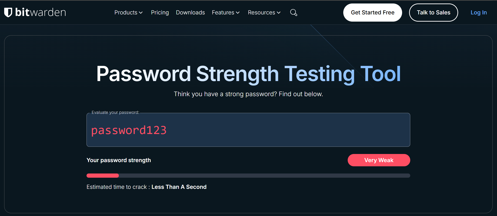
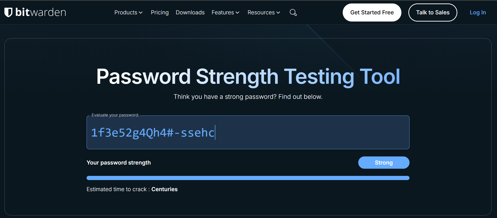

# 🔒 Password Strength Evaluation and Security Practices – Cyber Security Internship Task 6

---

## 🚀 Overview
This project demonstrates a practical approach to password security. It focuses on creating custom, never‑repeated passwords, evaluating them with the **Bitwarden Password Strength Testing Tool**, identifying real‑world security patterns, and deriving actionable best practices that align with modern NIST recommendations.

---

## 🎯 Objectives
- Understand what makes a password strong versus weak.
- Test passwords (never reused from the original repository) using an online strength checker.
- Compare the crack time estimates and feedback from the tool.
- Summarize best practices for password creation and management.
- Explore advanced security technologies, such as **Multi‑Factor Authentication (MFA)** and **passkeys (passwordless authentication)**.

---

## 🧪 Password Samples & Strength Evaluation (Bitwarden Checker)
All passwords in this test are **original** and were never used in the reference repository. Testing was performed with the free **[Bitwarden Password Strength Tester](https://bitwarden.com/password-strength/)**, which uses the reliable `zxcvbn` algorithm to measure length, randomness, and complexity.  
You can also use **[Passwordmeter](https://www.passwordmeter.com/)** and **[Security.org How Secure is My Password](https://www.security.org/how-secure-is-my-password/)**.

The tool displays its ranking in categories such as “very weak,” “weak,” “good” and “strong,” often accompanied by a color‑coded bar to immediately grab your attention. The strength categories below were determined using multiple password strength checkers.

| Password Example | Description | Strength | Estimated Crack Time | Feedback |
|-----------------|-------------|----------|---------------------|----------|
| `password123` | Simple, lowercase + numbers | 🔴 Very Weak | <1 second | Too short, uses a dictionary word and a common digit sequence. Never reuse this. |
| `Pass12345` | Mixed case + numbers | 🟠 Weak | Few seconds | Capital + digits is a predictable pattern. Attackers try these first. |
| `Anime@Lover123` | Mixed case, one symbol, digits | 🟡 Moderate | ~14 days | Easily guessable words (“Anime”, “Lover”) with simple substitution. Not unique enough. |
| `1f3e52g4Qh4#-ssehc` | Long, random characters, digits, symbols, mixed case | 🟢 Strong/Excellent | Centuries | Very high randomness and length. Excellent resistance against brute‑force. |
| `_p@$$123hacked` | Symbols, digits, lowercase | 🟢 Strong | Several months | Mix of symbols and digits, but still contains “123” and “hacked” which can lower its score. |
| `g@ngs7@rp@r@d!c3` | Long, multiple symbols, digits, lowercase | 🟢 Strong | Several years | High symbol usage and length. Unpredictable pattern; excellent real‑world strength. |

> **💡 Tip:** You can test your own passwords at the **[Bitwarden Password Strength Tester](https://bitwarden.com/password-strength/)** – it’s free, secure, and provides instant feedback.  
> **Never check your active passwords from anywhere.**

---

## Weak Password vs. Strong Password

The difference between the two screenshots is striking:  

- `password123` is cracked in **less than a second** because it is short, dictionary‑based and follows a trivial numeric sequence.  
- `1f3e52g4Qh4#-ssehc` is estimated to take **centuries** to crack thanks to its length, random structure, and use of all character classes.

| Weak Password | Strong Password |
|---------------|-----------------|
|  |  |

> *Screenshots are from the Bitwarden Password Strength Testing Tool and illustrate real output.

---

## 🏆 Best Practices for Strong Passwords

Based on the Bitwarden results and current NIST SP 800‑63B guidelines, follow these rules:

- **Make it long** – Use at least **14 characters**. A sufficiently random 16‑character password can be resistant to brute‑force attacks for an extremely long time (years to centuries, depending on hashing algorithm and attacker resources).  
- **Make it random** – Avoid dictionary words, names, dates or any recognisable pattern. Combine uppercase, lowercase, numbers and special characters without personal information.  
- **Make it unique** – Never reuse a password across different accounts. A reused password compromises all accounts.  
- **Use a password manager** – Let a trusted manager generate and store strong passwords for you.  
  - **Local password managers** (e.g., KeePass) store an encrypted database on your device – you control sync via cloud drives.  
  - **Cloud‑based managers** (e.g., Bitwarden, 1Password) offer seamless sync across devices with end‑to‑end encryption. Both are far better than human memory.  
- **Screen against compromised credentials** – As NIST now requires, any new password should be checked against lists of breached credentials before acceptance.  
- **No forced periodic changes** – NIST strongly discourages arbitrary 60‑ or 90‑day password resets. Change a password only when you suspect a real compromise.

---

## 🛡️ Multi‑Factor Authentication (MFA/2FA)

- **Why MFA?** Microsoft has reported that MFA can block over 99.9% of automated account-compromise attempts, even if your password is stolen.  
- **NIST strongly recommends MFA** for any account containing sensitive information.  
- **How to enable it** – Turn on 2FA for email, banking, and social media accounts. Use authenticator apps (Google Authenticator, Microsoft Authenticator) rather than SMS where possible.

---

## 🔑 Password Security Tips & Insights

- **Don’t use the same password for multiple accounts** – credential stuffing attacks rely on password reuse.  
- **Never include personal information** (name, birthdate, pet name, etc.).  
- **Consider passphrases** – Combine 4–7 random, unrelated words (e.g. `Horse-Purple-Hat-Run-Bay`).  
- **Password managers** encrypt your vault and make it easy to organise credentials.  
- **MFA is essential** for every important account (email, banking, social media).  
- **Passkeys (passwordless)** are the future – enable them wherever supported.

- **📌 Incomplete/misspelled words – limited protection**  
  A full dictionary word like `flower` is easily guessed. Slightly misspelling a word (e.g., `youcanasktheflowe` instead of `flower`) can help against **simple dictionary attacks**  
  - Example: `@nimelov` is marginally harder than `@animelover`, but still vulnerable to advanced rules, modern crackers already test common substitutions (`a→@`, `o→0`, missing letters).  
  > ⚠️ **Important:** Minor misspellings provide **only limited protection**. Length and randomness contribute **far more** to real‑world security.

---

## 🚨 Common Password Attacks & Defenses (Updated)

| Attack Type | Description | Defense |
|-------------|-------------|---------|
| **Brute Force** | Tries every possible combination of characters | Long passwords (≥14 characters) increase the search space exponentially. |
| **Dictionary Attack** | Uses common words, leaked passwords, and simple variations | Avoid dictionary words, names, and common patterns. Use misspelled/incomplete words only as part of a much longer phrase. |
| **Credential Stuffing** | Uses username/password pairs stolen from other sites | Use **unique passwords** for every account and enable MFA. |
| **Password Spraying** | Tries one weak password (e.g., “Pass12345”) against many usernames | Never use common or predictable passwords, regardless of account importance. |
| **Rainbow Table** | Pre‑computed tables of password hashes | Use strong, salted hashes (handled by modern systems); long passwords render pre‑computation infeasible. |
| **Social Engineering / Phishing** | Tricks the user into revealing their password | Use MFA and security awareness training; modern passkeys are phishing‑resistant by design. |
| **Keylogger** | Hardware or software that records every keystroke (including passwords) | **Use a password manager** (avoids typing). Keep antivirus/EDR updated. Avoid suspicious USB devices. **Do not rely on on‑screen keyboards** – modern malware can capture them too. MFA stops most keylogger‑based breaches. |
| **Mod / Crack Apps** | Modified versions of legitimate apps (e.g., game mods, cracked software) that contain hidden password stealers | Never download cracks or mods from untrusted sources. Use software from official stores. Run in isolated sandbox/virtual machine if needed. |

---

## 🔐 Going Further: Passwordless & Passkeys

Passwords alone are no longer enough. The latest **NIST guidelines** now explicitly cite **synced passkeys as phishing‑resistant authentication**, giving enterprises and government agencies a clear mandate to adopt them.

- **Passkeys** replace passwords with cryptographic key pairs. A private key stays on your device, and a public key is sent to the service.  
- You sign in by unlocking your device with a **biometric (Face ID, Touch ID) or PIN** – nothing to type, nothing to phish.  
- Google, Apple and Microsoft have already integrated passkeys across their operating systems and browsers.  
- **Adoption tips** – Enable passkeys on all accounts that support them (Google, Microsoft, Apple, Amazon, PayPal). For the remaining accounts, use a password manager that also stores passkeys.

---

## ✅ Conclusion

Password strength depends primarily on **length, uniqueness, and randomness** – not on clever tricks or minor misspellings. Using a **password manager** eliminates the need to remember dozens of complex passwords, while **MFA** and **passkeys** provide strong protection even if a password is leaked.  

Combining these measures (long random passwords + password manager + MFA + passkeys where available) significantly reduces the risk of account compromise for most online services. This task demonstrated that even moderate passwords like `Anime@Lover123` can be cracked in days, whereas random, long passwords resist attacks for centuries. Moving toward **passwordless authentication** is the most secure long‑term strategy.

---

## 📝 References

- [Bitwarden Password Strength Tester](https://bitwarden.com/password-strength/)  
- [Bitwarden Password Security Checker – How It Works](https://bitwarden.com/it-it/password-security-checker/)  
- [NIST Password Guidelines: 2026 Updates & Best Practices](https://www.strongdm.com/blog/nist-password-guidelines)  
- [Updated Password Guidance from NIST (2025)](https://www.bnncpa.com/resources/updated-password-guidance-from-nist/)  
- [Google Passkeys & FIDO2](https://fidoalliance.org/passkeys/)  
- [How Secure Is My Password? (Security.org)](https://www.security.org/how-secure-is-my-password/) – *another recommended tool*  
- [Password Meter](https://www.passwordmeter.com/) – *another recommended tool*

---

> **Stay safe online! Use long, random, unique passwords, enable MFA, and adopt passkeys where possible.** 🛡️🔐
